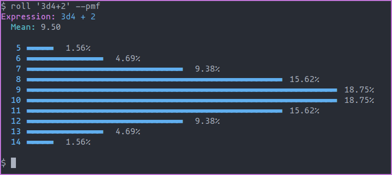

Roll
====

An advanced dice roller and probability calculator.



## Stability

Roll is beta software and the author provides no guarantees about its behavior, despite
his feeble efforts. It probably won't destroy anything on your computer, but it could
evaluate your expression incorrectly.

## Typical usage

Roll a standard 6-sided die.

```bash
$ roll d6

Expression: 1d6
Rolls:
  d6: {5}

5
```

Roll two 6-sided dice and sum the results.

```bash
$ roll 2d6
Expression: 2d6
Rolls:
  d6: {1, 3}

4
```

Roll a 20-sided dice and add 3.

```bash
$ roll 1d20+3
Expression: 1d20 + 3
Rolls:
  d20: {7}

10
```

Roll three 6-sided dice and format the results as
[JSON](https://www.json.org/json-en.html).

```bash
$ roll 3d6 --json
{"rolls":{"d6":[5,2,3]},"value":10}
```

Roll four 4-sided dice and add four. Then, display the [probability mass
function](https://en.wikipedia.org/wiki/Probability_mass_function) associated with that
expression.

```bash
$ roll 4d4+4 --pmf
Expression: 4d4 + 4
  Mean: 14.00

   8 ▬   0.39%
   9 ▬▬▬▬▬   1.56%
  10 ▬▬▬▬▬▬▬▬▬▬▬▬▬▬   3.91%
  11 ▬▬▬▬▬▬▬▬▬▬▬▬▬▬▬▬▬▬▬▬▬▬▬▬▬▬▬▬   7.81%
  12 ▬▬▬▬▬▬▬▬▬▬▬▬▬▬▬▬▬▬▬▬▬▬▬▬▬▬▬▬▬▬▬▬▬▬▬▬▬▬▬▬▬▬▬  12.11%
  13 ▬▬▬▬▬▬▬▬▬▬▬▬▬▬▬▬▬▬▬▬▬▬▬▬▬▬▬▬▬▬▬▬▬▬▬▬▬▬▬▬▬▬▬▬▬▬▬▬▬▬▬▬▬▬▬▬  15.62%
  14 ▬▬▬▬▬▬▬▬▬▬▬▬▬▬▬▬▬▬▬▬▬▬▬▬▬▬▬▬▬▬▬▬▬▬▬▬▬▬▬▬▬▬▬▬▬▬▬▬▬▬▬▬▬▬▬▬▬▬▬▬▬▬  17.19%
  15 ▬▬▬▬▬▬▬▬▬▬▬▬▬▬▬▬▬▬▬▬▬▬▬▬▬▬▬▬▬▬▬▬▬▬▬▬▬▬▬▬▬▬▬▬▬▬▬▬▬▬▬▬▬▬▬▬  15.62%
  16 ▬▬▬▬▬▬▬▬▬▬▬▬▬▬▬▬▬▬▬▬▬▬▬▬▬▬▬▬▬▬▬▬▬▬▬▬▬▬▬▬▬▬▬  12.11%
  17 ▬▬▬▬▬▬▬▬▬▬▬▬▬▬▬▬▬▬▬▬▬▬▬▬▬▬▬▬   7.81%
  18 ▬▬▬▬▬▬▬▬▬▬▬▬▬▬   3.91%
  19 ▬▬▬▬▬   1.56%
  20 ▬   0.39%
```

### Available Operators

Roll supports a handful of operators that, when combined, form expressions. This is a
complete list of the available operators and their limits. Unless otherwise stated,
`roll` evaluates operators listed earlier before those listed later.

 * **Literal.** Representation of a fixed value. There is no effective limit on literal
   size, but some operators have relevant limits. Literals cannot have any fractional
   part. E.g. `3` or `-(2 ** 256) + 1`.
 * **Grouping.** Indicates roll should evaluate the enclosed subexpression before the
   reminder of the expression. E.g. `(1 + 2) * 3` or `(2d4)d(2d6)`.
 * **Dice.** Rolls a dice with the right operand sides the left operand times and
   computes the sum. An elided left operand takes the value of 1. Neither the left or
   right operand may exceed 2⁶⁴ - 1 on 64-bit operating systems. E.g. `3d6` or `d4d6`.
 * **Unary Plus.** The operand remains unchanged. E.g. `+32` or `+1d100`.
 * **Unary Minus.** Negates the value of the operand. E.g. `-12` or `-(1d4)`.
 * **Exponentiation.** Multiplies the left operand by itself the right operand times.
   The right operand cannot exceed 2⁶⁴ - 1 on 64-bit operating systems. E.g. `2 ** 3` or
   `-1 ** 1d4`. 
 * **Multiplication.** Adds the left operand to itself the right operand times. Roll
   evaluates multiplication and integer division left to right. E.g. `6 * 8` or
   `3d6 * 3d6`.
 * **Integer Division.** The number of times the right operand can be _completely_
   subtracted from the left. Roll evaluates multiplication and integer division left to
   right. E.g. `11 / 4` or `1d100 / 2d4`.
 * **Addition.** Counts the total number between both operands. Roll evaluates addition
   and subtraction left to right. E.g. `2 + 2` or `1d6 + 1d6 + 1d6`.
 * **Subtraction.** Removes the right operand from the left operand. Roll evaluates
   addition and subtraction left to right. E.g. `2 - 1` or `1d6 - 1d4`.

## Installation

A single method exists to install `roll`, from the source. We hope to improve this in
the future.

### From source

If your system supports [nix flakes](https://nixos.wiki/wiki/Flakes), run `nix develop`
to enter a development shell. Otherwise, ensure you have a recent version of rustc and
cargo installed.

Next clone the repository and run cargo build.

```bash
$ git clone https://github.com/taylor1791/roll.git
$ cd roll
$ cargo build --relase
$ cp ./target/release/roll $INSTALL_DIR
```

## Running the test suite

Run the following to run the unit and integration tests.

```bash
$ cargo test
```

## Running the benchmark suite

Run the following to run roll's benchmarks. Note that running the benchmarks a second
time will show the differences in performance between runs.

```bash
$ cargo bench
$ open target/criterion/report/index.html
```
